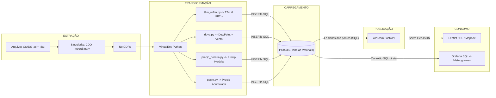
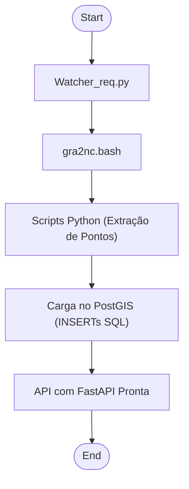

# Arquitetura de Dados BRAMS: Do ETL à API com PostGIS e FastAPI

## Introdução
O Centro de Excelência em Estudos, Monitoramento e Previsões Ambientais do Cerrado (CEMPA-Cerrado) produz dados de previsão do tempo de alta precisão com o modelo **BRAMS**. No entanto, o formato técnico desses dados (GrADS) e sua apresentação como imagens estáticas limitam seu uso pelo público geral, agricultores e gestores públicos.

Este documento apresenta uma solução arquitetural e um **pipeline técnico** completo para resolver esse desafio, transformando os dados brutos do BRAMS em um serviço de dados interativo. A arquitetura aqui descrita abandona a abordagem tradicional de servidores GIS em favor de uma **API customizada com FastAPI**, oferecendo maior flexibilidade e controle sobre a disponibilização dos dados. O objetivo é detalhar de forma prática:

1.  Como converter as saídas GrADS (`.ctl`/`.dat`) para o formato **NetCDF**.
2.  Como processar os dados NetCDF com **Python** para gerar produtos em **GeoTIFF**.
3.  Como carregar e otimizar o armazenamento de dados **raster no PostGIS**.
4.  Como desenvolver uma **API REST com FastAPI** para servir os dados dinamicamente.
5.  Como implementar estratégias de cache (ex: Redis) para otimizar **as respostas da API**, diminuindo a carga no banco de dados.
6.  Como **consumir os dados** em aplicações de mapa interativas e dashboards analíticos.

### Requisitos Atendidos pela Arquitetura
Esta arquitetura foi projetada para atender a um conjunto de requisitos funcionais (RF) e não funcionais (RNF) chave, documentados no `Documento de Requisitos do Sistema - CEMPA (V2).docx`.

* **Visualização Interativa e Acesso aos Dados (GeoJSON via API):** A capacidade de servir os dados como GeoJSON é o núcleo da nova solução. Isso permite que o frontend tenha acesso aos valores numéricos, possibilitando uma interatividade rica e atendendo diretamente aos requisitos **[RF001] (Acessar Painel)**, **[RF005] (Personalização de Localização)**, **[RF006] (Seleção de Variáveis)** e **[RF011] (Sistema de Tooltips Explicativos)**, já que os tooltips podem agora mostrar dados precisos.
* **Download e Manipulação de Dados:** Ao estruturar os dados em um banco relacional, a arquitetura habilita a extração customizada de informações. A API pode facilmente consultar e formatar esses dados para download, cumprindo o requisito **[RF007] (Download Personalizado de Dados)** em formatos como CSV e JSON.
* **Performance, Acessibilidade e Responsividade:** As decisões arquiteturais suportam os principais requisitos não funcionais. A performance do **[RNF001] (Tempo de Carregamento)** é alcançada através de consultas otimizadas no PostGIS e estratégias de cache na API. O desacoplamento entre backend e frontend permite que a equipe de desenvolvimento foque em atender plenamente aos requisitos de **[RNF002] (Acessibilidade)** e **[RNF003] (Responsividade)** na camada de apresentação.
* **Análise de Séries Temporais (Grafana):** A conexão direta do Grafana ao PostGIS, que lê as tabelas vetoriais, é uma forma eficiente de gerar gráficos de séries temporais (meteogramas), atendendo a parte do requisito **[RF013] (Legendas e Indicadores Visuais)** de forma analítica e complementar à interface principal.

## Diagrama Geral do Pipeline



**Explicação do diagrama:**
* **Extração:** os arquivos brutos (`.ctl` e `.dat`) do BRAMS são convertidos em **NetCDF** usando o CDO dentro de um container Singularity, garantindo consistência de ambiente.
* **Transformação:** em um ambiente Python VirtualEnv, scripts especializados **extraem os valores numéricos** de cada variável para cada ponto da grade, preparando-os para a inserção no banco de dados.
* **Carregamento:** os dados pontuais extraídos são inseridos diretamente nas **tabelas vetoriais** do PostGIS através de comandos `INSERT` SQL, populando o modelo de dados relacional.
* **Publicação:** Uma API customizada com FastAPI se conecta ao PostGIS, lê os dados vetoriais (pontos) e os serializa no formato **GeoJSON** sob demanda.
* **Consumo:** Clientes web (Leaflet, etc.) consomem os dados **GeoJSON** da API para renderizar camadas interativas no mapa; Grafana mantém sua conexão direta ao PostGIS para criar meteogramas.
---

## 1. Extração: GrADS para NetCDF

### 1.1 Arquivos de Origem

* **.ctl:** metadados do GrADS informando dimensões (lon, lat, tempo), variáveis e formato binário.
* **.dat/.bin:** dados brutos do modelo.

### 1.2 Conversão com CDO

**Container Singularity:** as dependências do CDO são encapsuladas em um container para reprodutibilidade.

```bash
singularity exec brams-cdo.sif \
  cdo -f nc import_binary \
    /data/brams_run/analise.ctl \
    /data/netcdf/2025052600/analise.nc
```

* `brams-cdo.sif`: imagem Singularity com CDO instalado.
* Gera `analise.nc` contendo todas as variáveis e tempos.

> **Dica:** use `cdo sinfo analise.nc` para listar variáveis e dimensões.

---

## 2. Transformação: Cálculos e Produtos Derivados

Todos os scripts Python rodam em um **VirtualEnv** (Python 3.8+) que inclui:
* `netCDF4`,
* `numpy`,
* `matplotlib`,
* `mpl_toolkits.basemap`,
* `gdal`,
* `psycopg2`.

```python
# Exemplo simplificado de extração para a variável 'temperatura a 2m'
from netCDF4 import Dataset
import numpy as np

# Carrega o arquivo NetCDF
nc = Dataset('analise.nc')
lats = nc.variables['lat'][:]
lons = nc.variables['lon'][:]
t2m_data = nc.variables['t2m'][0] - 273.15  # Kelvin para °C
id_variavel_t2m = 1 # Supondo que o ID da variável 't2m' no nosso DB seja 1

dados_para_inserir = []

# Itera sobre cada ponto da grade para criar os registros
for lat_idx, lat in enumerate(lats):
    for lon_idx, lon in enumerate(lons):
        # Função hipotética que busca o ID do local no DB com base nas coordenadas
        ponto_id = get_ponto_id_from_db(lat, lon) 
        valor_temp = t2m_data[lat_idx, lon_idx]
        
        # Prepara o dado para inserção no banco
        dados_para_inserir.append(
            (ponto_id, id_variavel_t2m, '2025-06-18 12:00:00Z', valor_temp)
        )

# A lista 'dados_para_inserir' seria então usada para uma carga em massa no PostGIS.
```
---

### **3. Carregamento no PostGIS (Vetorial)**
O carregamento deixa de usar `raster2pgsql`. Agora, os dados são inseridos nas tabelas relacionais (`LOCAIS`, `VARIAVEIS`, `PREVISOES`) que projetamos no `Documento de Arquitetura`. Esta abordagem armazena os dados de forma estruturada, e não como imagens.

#### **3.1. Preparação do Banco**
```sql
-- Garante que a extensão PostGIS para funções geoespaciais esteja ativa
CREATE EXTENSION IF NOT EXISTS postgis;

-- Exemplo da Tabela PREVISOES que receberá os dados
CREATE TABLE PREVISOES (
    id_previsao BIGSERIAL PRIMARY KEY,
    id_local INTEGER REFERENCES LOCAIS(id_local),
    id_variavel INTEGER REFERENCES VARIAVEIS(id_variavel),
    data_hora_previsao TIMESTAMP WITH TIME ZONE,
    valor REAL
);
```

#### **3.2. Importando os Dados**
O script Python de ETL usaria uma biblioteca como `psycopg2` para executar comandos `INSERT` em massa (batch), populando a tabela `PREVISOES` de forma eficiente com os dados extraídos na etapa de transformação.

---


### **4. Publicação com API Dinâmica (FastAPI)**

Nesta abordagem, em vez de usar um servidor GIS completo como GeoServer, desenvolvemos uma API leve e de alta performance com FastAPI para servir os dados raster diretamente do PostGIS. Isso nos dá controle total sobre a lógica, autenticação e performance.

**4.1. Arquitetura da API**
A função da API agora é consultar as tabelas relacionais no PostGIS e serializar (converter) os resultados no formato GeoJSON, pronto para ser consumido por clientes web.

**4.3. Exemplo de Endpoint (Pseudo-código)**

```python
# Exemplo de Endpoint que retorna GeoJSON
from fastapi import FastAPI
from fastapi.responses import JSONResponse

app = FastAPI()

@app.get("/v1/previsoes/ponto", response_class=JSONResponse)
async def get_previsao_ponto(lat: float, lon: float):
    # 1. Conectar ao DB e encontrar o id_local mais próximo usando PostGIS
    local_info = await find_nearest_local_from_db(lat, lon)
    
    # 2. Buscar todas as previsões para aquele id_local
    previsoes = await get_forecasts_for_local_from_db(local_info['id'])

    # 3. Construir a estrutura GeoJSON com os dados
    feature = {
        "type": "Feature",
        "geometry": local_info['geometry'], # Formato GeoJSON Point
        "properties": {
            "local_id": local_info['id'],
            "municipio": local_info['municipio'],
            "previsoes": previsoes # Lista de {variavel, valor, data_hora}
        }
    }
    
    return {"type": "FeatureCollection", "features": [feature]}
```


---
### **5. Consumo: WebMaps e Dashboards**

Os clientes web consomem um endpoint de dados e usa camadas GeoJSON para renderizar as informações, o que permite muito mais interatividade (clicar em um ponto, mostrar pop-ups com valores, estilizar com base nos dados).


#### **5.1. Leaflet**
```javascript
// Exemplo de como buscar e exibir dados GeoJSON no mapa
fetch('https://api.servidor.com/v1/previsoes/ponto?lat=-16.68&lon=-49.25')
  .then(response => response.json())
  .then(data => {
    L.geoJSON(data, {
      onEachFeature: function (feature, layer) {
        // Extrai as propriedades para montar um pop-up interativo
        const props = feature.properties;
        let popupContent = `<b>${props.municipio}</b><br/>`;
        
        const temp = props.previsoes.find(p => p.variavel === 'temperatura_2m');
        if (temp) {
            popupContent += `Temperatura: ${temp.valor.toFixed(1)}°C`;
        }
        layer.bindPopup(popupContent);
      }
    }).addTo(map);
  });
```

### 5.2 Grafana

* **Meteogramas:** usar **PostgreSQL datasource** e query:

  ```sql
  SELECT timestamp,
    ST_Value(rast, 1,
      ST_SetSRID(ST_MakePoint(lon,lat),4326)
    ) AS valor
  FROM rasters_meteo
  WHERE ST_Intersects(rast, ST_SetSRID(ST_MakePoint(lon,lat),4326))
  ORDER BY timestamp;
  ```
* **Mapas raster:** plugin **Geomap WMS** para consumir WMS/WMTS.

---

## 6. Orquestração e Automação



* **watcher\_req.py:** monitora chegada de novos `.ctl` e dispara o pipeline.
* **Airflow:** DAGs com `BashOperator` e `PostgresOperator` para controle e retries.
* **Cron:** fallback para agendamento simples em horários fixos.
