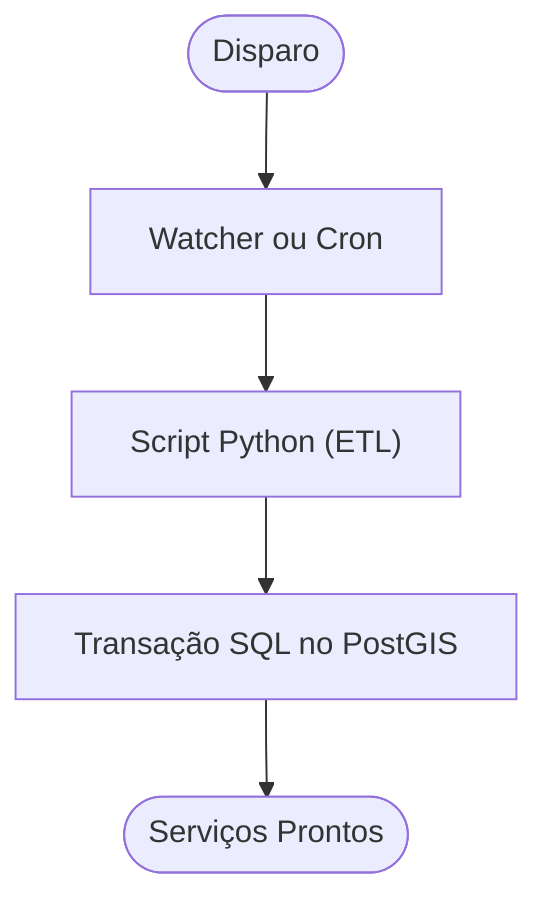

# **Pipeline Técnico: Transformando Dados BRAMS em um Serviço Interativo com Python, PostGIS e uma Arquitetura de Serviços Dupla**

## Introdução

O Centro de Excelência em Estudos, Monitoramento e Previsões Ambientais do Cerrado (CEMPA) produz dados de previsão do tempo de alta precisão com o modelo BRAMS. No entanto, o formato técnico desses dados (GrADS) e a apresentação como imagens estáticas limitam seu uso interativo e a integração com outras aplicações.

Este documento apresenta o pipeline técnico detalhado para implementar a **Arquitetura da Solução Proposta**, transformando os dados brutos do BRAMS em serviços de dados modernos, performáticos e escaláveis. A arquitetura abandona a geração de imagens estáticas em favor de uma abordagem de "Dados como Serviço" (DaaS), com dois componentes principais:

1.  Uma **API REST com FastAPI** para fornecer dados pontuais e tabulares (previsões para um local, dados para gráficos, downloads em CSV).
2.  Um **Servidor de Vector Tiles (Martin)** para visualizar a malha completa de dados no mapa de forma fluida e eficiente.

Este documento detalha de forma prática:

1.  Como ler os dados brutos do BRAMS (`.ctl`/`.gra`) diretamente com **Python (`xarray`)**.
2.  Como transformar os dados da grade em um formato vetorial (`GeoDataFrame`) usando **GeoPandas**.
3.  Como carregar esses dados de forma massiva e otimizada em um banco de dados **PostGIS**.
4.  Como desenvolver a arquitetura de serviços dupla: a **API REST (FastAPI)** para consultas específicas e o **Servidor de Vector Tiles (Martin)** para visualização da malha.
5.  Como implementar estratégias de otimização, como particionamento de tabelas e índices espaciais.
6.  Como consumir os dados em aplicações de mapa interativas com **MapLibre GL JS**.

### Requisitos Atendidos pela Arquitetura

Esta arquitetura foi projetada para atender aos requisitos chave do `Documento de Requisitos do Sistema - CEMPA (V2)`.

*   **Visualização Interativa e Acesso aos Dados:** A combinação do Servidor de Vector Tiles para a malha e a API REST para dados pontuais (GeoJSON) é o núcleo da solução. Isso permite interatividade rica, atendendo diretamente aos requisitos **[RF001] (Acessar Painel)**, **[RF005] (Personalização de Localização)**, **[RF006] (Seleção de Variáveis)** e **[RF010] (Sistema de Tooltips Explicativos)**.
*   **Download e Manipulação de Dados:** Com os dados estruturados em um banco relacional, a API REST pode facilmente consultar e formatar dados para download, cumprindo o requisito **[RF007] (Download Personalizado de Dados)** em formatos como CSV e JSON, e **[RF008]** (Geração de Relatórios em PDF).
*   **Performance, Acessibilidade e Responsividade:** As decisões arquiteturais suportam os requisitos não funcionais. A performance do **[RNF001] (Tempo de Carregamento)** e **[RNF004] (Performance Visual)** é alcançada por três pilares: backend otimizado (PostGIS + Martin), entrega de dados otimizada (Vector Tiles) e renderização acelerada por GPU (MapLibre GL JS). O desacoplamento permite que a equipe de frontend atenda aos requisitos de **[RNF002] (Acessibilidade)**, **[RNF003] (Responsividade)** e **[RNF010] (Compatibilidade Mobile)**.
*   **Consistência e Usabilidade:** A arquitetura modular suporta um Design System unificado, atendendo **[RNF005] (Consistência Visual)** e **[RNF009] (Interface Intuitiva)**. As preferências do usuário podem ser salvas, conforme **[RNF007] (Persistência de Preferências)**.

## Diagrama Geral do Pipeline

```mermaid
graph LR
  subgraph "INGESTÃO DE DADOS (ETL EM PYTHON)"
    A1["Arquivos BRAMS .ctl + .gra"] --> B1["Script Python"];
    subgraph B1
        direction LR
        B2["xarray: Lê dados<br>multidimensionais"] --> B3["GeoPandas: Transforma<br>grade em pontos<br>(GeoDataFrame)"];
    end
  end

  subgraph "ARMAZENAMENTO (POSTGIS)"
    B3 --> C1["Bulk Load (COPY)"];
    C1 --> C2["Tabela PREVISOES_STAGING"];
    C2 --> C3["Troca Atômica"];
    C3 --> D1[("Tabela de Produção<br>PREVISOES")];
  end

  subgraph "PUBLICAÇÃO (SERVIÇOS DE BACKEND)"
    D1 -- "Gera Tiles dinamicamente" --> E1["Servidor de Vector Tiles<br>(Martin)"];
    D1 -- "Consulta SQL para pontos" --> E2["API REST (FastAPI)"];
  end

  subgraph "CONSUMO (FRONTEND)"
    E1 -- "Serve Vector Tiles (.mvt)" --> G1["Cliente de Mapa<br>(MapLibre GL JS)<br>Renderiza a malha<br>completa"];
    E2 -- "Serve GeoJSON / JSON" --> G2["Gráficos, Tooltips<br>e Downloads"];
    G1 --> G2
  end
```


## 1. Extração e Transformação com Python
O pipeline usa Python para ir diretamente da fonte ao formato vetorial desejado. O ambiente Python deve incluir `xarray`, `pandas`, `geopandas`, e `sqlalchemy`/`psycopg2`.

```python
# Exemplo simplificado de extração e transformação
import xarray as xr
import geopandas as gpd
import pandas as pd

# 1. Extração com xarray
ds = xr.open_dataset('analise.ctl', engine='gradsc')

# Seleciona a variável e o tempo desejado
temp_data = ds['t2m'].isel(time=0).values - 273.15 # Kelvin para Celsius
lats = ds['lat'].values
lons = ds['lon'].values

# 2. Transformação com Pandas e GeoPandas
df = pd.DataFrame(temp_data, index=lats, columns=lons)
df = df.stack().reset_index()
df.columns = ['latitude', 'longitude', 'temperatura']

gdf = gpd.GeoDataFrame(
    df,
    geometry=gpd.points_from_xy(df.longitude, df.latitude),
    crs="EPSG:4326"
)
```

### **2. Carregamento no PostGIS (Vetorial)**
Os dados são carregados de forma estruturada nas tabelas relacionais (`LOCAIS`, `VARIAVEIS`, `PREVISOES`).

#### **2.1. Preparação das Tabelas**
```sql
CREATE EXTENSION IF NOT EXISTS postgis;

CREATE TABLE PREVISOES (
    id_previsao BIGSERIAL PRIMARY KEY,
    id_local INTEGER REFERENCES LOCAIS(id_local),
    id_variavel INTEGER REFERENCES VARIAVEIS(id_variavel),
    data_hora_previsao TIMESTAMP WITH TIME ZONE NOT NULL,
    valor REAL
);

CREATE INDEX idx_previsoes_query ON PREVISOES (id_variavel, data_hora_previsao);
```

#### **2.2. Carga em Massa (Bulk Loading)**
O script ETL usa métodos como `to_postgis` do GeoPandas ou `copy_expert` do `psycopg2` para uma carga em massa rápida em uma tabela de *staging*, seguida de uma transação atômica para a tabela de produção.

### **3. Publicação: A Arquitetura de Serviços Dupla**

#### **3.1. API REST com FastAPI (Para Dados Pontuais)**
Serve para consultas que não envolvem a renderização da malha inteira (séries temporais, downloads).

```python
# api.py (Exemplo de Endpoint)
from fastapi import FastAPI
from database import get_forecasts_for_location # Função que consulta o DB

app = FastAPI()

@app.get("/api/v1/previsoes/ponto")
async def get_previsao_ponto(lat: float, lon: float):
    feature_collection = await get_forecasts_for_location(lat, lon)
    return feature_collection
```

#### **3.2. Servidor de Vector Tiles com Martin (Para a Malha)**
Serviço de alta performance para a visualização do mapa, servindo a grade no formato **MVT (.pbf)**.
*   **Endpoint Conceitual:** `GET /tiles/variaveis/{z}/{x}/{y}?variavel=temperatura_2m&timestamp=...`

### **4. Consumo: Web Map com MapLibre GL JS**
O cliente web usa **MapLibre GL JS** por sua performance otimizada na renderização de Vector Tiles.

```javascript
const map = new maplibregl.Map({ /* ... configurações ... */ });

map.on('load', () => {
    map.addSource('cempa-tiles', {
        type: 'vector',
        tiles: ['http://localhost:3000/tiles/variaveis/{z}/{x}/{y}?variavel=temperatura_2m&timestamp=...']
    });
    map.addLayer({
        'id': 'temperatura-layer',
        'type': 'circle',
        'source': 'cempa-tiles',
        'source-layer': 'public.previsoes',
        'paint': { /* ... estilo dinâmico ... */ }
    });
});

map.on('click', 'temperatura-layer', (e) => {
    const coords = e.lngLat;
    fetch(`/api/v1/previsoes/ponto?lat=${coords.lat}&lon=${coords.lon}`)
      .then(res => res.json())
      .then(data => { /* ... exibe popup com dados da API ... */ });
});
```

### **5. Grafana**
Para gerar meteogramas, o Grafana pode se conectar à fonte de dados **PostgreSQL** e executar uma query para buscar a série temporal de um ponto.
```sql
-- Query para buscar a série temporal de temperatura para o local mais próximo
-- de uma dada latitude e longitude.
SELECT
  p.data_hora_previsao AS "time",
  p.valor
FROM PREVISOES p
JOIN (
  -- Subquery para encontrar o ID do local mais próximo
  SELECT id_local
  FROM LOCAIS
  ORDER BY geometria <-> ST_SetSRID(ST_MakePoint(-49.25, -16.68), 4326)
  LIMIT 1
) AS local_proximo ON p.id_local = local_proximo.id_local
WHERE
  p.id_variavel = (SELECT id_variavel FROM VARIAVEIS WHERE nome_variavel = 'temperatura_2m') AND
  $__timeFilter(p.data_hora_previsao)
ORDER BY 1;
```

### **6. Orquestração e Automação**

*   **Disparo:** Um `watcher` monitora a chegada de novos arquivos ou um agendador (`cron`, `Airflow`) dispara o processo.
*   **Orquestração:** **Apache Airflow** é a ferramenta recomendada para controle robusto, com retentativas e logs.

---

## 7. Referências

### Documentos e Artefatos do Projeto
*   **Documento de Requisitos do Sistema - CEMPA (V2):** Documento que estabelece os requisitos funcionais e não-funcionais que guiaram o design desta arquitetura. [Documento](https://docs.google.com/document/d/151t7KkEFybwVDs5brnXSM7g822uNCJW4lfQ-kC9Y6ss/edit?usp=sharing)
*   **Documento de Arquitetura da Solução Proposta:** Documento que detalha uma arquitetura de sistema moderna e de alta performance, projetada para a nova plataforma de visualização de dados meteorológicos do CEMPA/UFG. [Documento](https://docs.google.com/document/d/1NXOI43N8yXk8bXJwnwMWZRJmKD6zhAOC/edit?usp=sharing&ouid=115475883847434972692&rtpof=true&sd=true)

### Linguagens e Ecossistemas
*   **Python:** Linguagem de programação principal utilizada para o desenvolvimento do pipeline de ETL e da API REST. https://www.python.org
*   **Rust:** Linguagem de programação de sistemas na qual o servidor de tiles Martin é desenvolvido, conhecida por sua performance e segurança. https://www.rust-lang.org

### Pipeline de Dados (ETL)
*   **xarray:** Biblioteca Python fundamental para a leitura e manipulação de dados científicos multidimensionais. https://xarray.pydata.org
*   **GeoPandas:** Extensão do Pandas que facilita a manipulação de dados geoespaciais em Python. https://geopandas.org
*   **Dask:** Biblioteca de computação paralela em Python, sugerida para acelerar a etapa de transformação. https://dask.org
*   **SQLAlchemy:** Toolkit SQL e Mapeador Objeto-Relacional (ORM) para Python, para interação com o banco de dados. https://www.sqlalchemy.org

### Banco de Dados e Armazenamento
*   **PostgreSQL:** Sistema de Gerenciamento de Banco de Dados relacional de código aberto, escolhido como base para o Data Warehouse. https://www.postgresql.org
*   **PostGIS:** Extensão geoespacial para o PostgreSQL, que adiciona suporte a objetos geográficos e funções espaciais. https://postgis.net

### Serviços e APIs (Backend)
*   **FastAPI:** Framework web moderno e de alta performance para a construção da API REST em Python. https://fastapi.tiangolo.com
*   **Martin:** Servidor de Vector Tiles de código aberto e alta performance, responsável por servir a malha de dados diretamente do PostGIS. https://github.com/maplibre/martin
*   **Mapbox Vector Tile (MVT):** Padrão aberto para codificação de dados geoespaciais vetoriais em tiles. https://github.com/mapbox/vector-tile-spec
*   **GeoJSON:** Formato padrão aberto para codificação de dados geográficos, utilizado nas respostas da API REST. https://geojson.org

### Apresentação (Frontend)
*   **MapLibre GL JS:** Biblioteca JavaScript de código aberto para renderização de mapas interativos a partir de Vector Tiles. https://maplibre.org/maplibre-gl-js/docs/
*   **React:** Biblioteca JavaScript sugerida para a construção da interface do usuário (Single-Page Application). https://react.dev
*   **Vue.js:** Framework JavaScript progressivo, apresentado como alternativa ao React. https://vuejs.org
*   **Chart.js / D3.js:** Bibliotecas JavaScript para a criação de gráficos dinâmicos. https://www.chartjs.org e https://d3js.org

### Implantação e Infraestrutura (DevOps)
*   **Docker:** Plataforma de conteinerização utilizada para empacotar e isolar os diferentes serviços da aplicação. https://www.docker.com
*   **Nginx:** Servidor web e proxy reverso de alta performance, utilizado como Gateway de entrada para a aplicação. https://www.nginx.com
