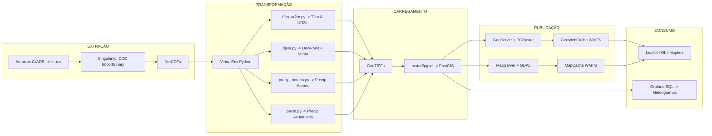
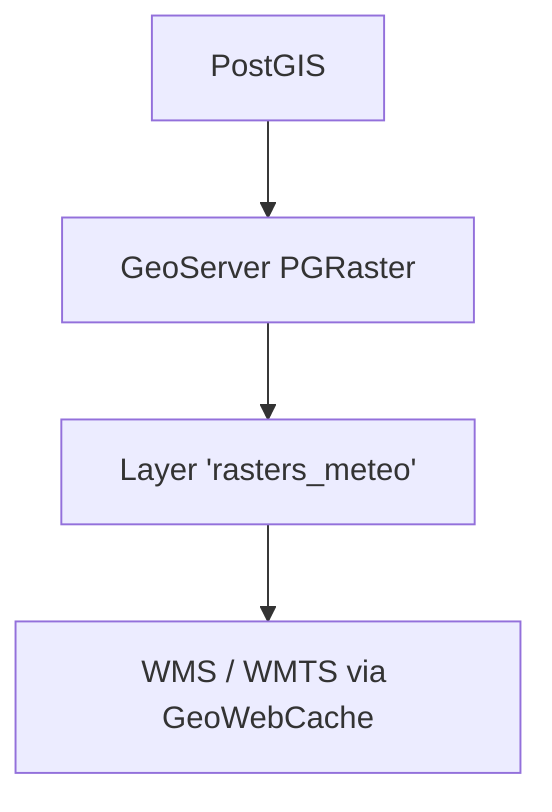
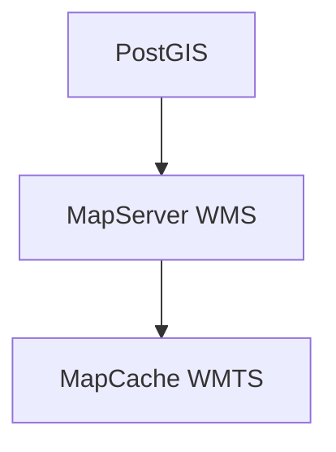
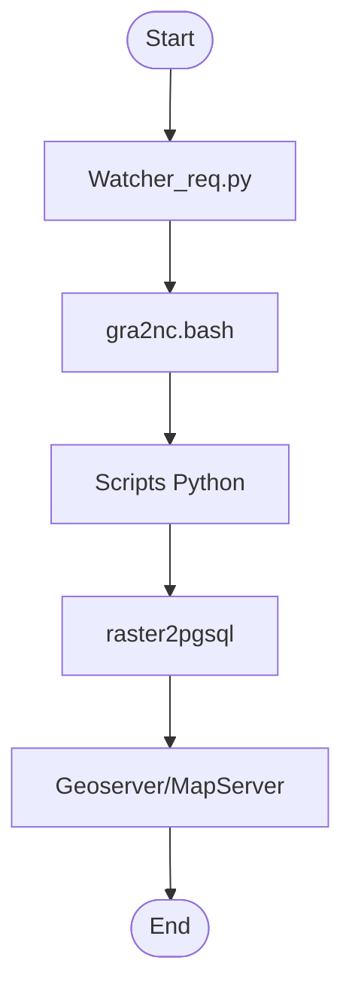

# Pipeline ETL de Dados Meteorológicos BRAMS com PostGIS e Serviços OGC

## Introdução

Este documento apresenta em detalhes um **pipeline ETL** completo para processar dados de previsão do **BRAMS** (Brazilian Regional Atmospheric Modeling System), contemplando desde os arquivos brutos gerados pelo modelo até dashboards interativos na web. O objetivo é demonstrar de forma didática e prática:

1. Como converter saídas GrADS para NetCDF.
2. Processar, visualizar e gerar produtos meteorológicos derivadas (PNG e GeoTIFF).
3. Armazenar rasters de forma otimizada em **PostGIS**.
4. Publicar camadas via **OGC** (WMS, WMTS) usando **GeoServer** ou **MapServer**.
5. Configurar cache de tiles com **GeoWebCache** ou **MapCache**.
6. Consumir as camadas em aplicações web (Leaflet, Mapbox GL JS, OpenLayers) ou/e em dashboards (Grafana).
---

## Diagrama Geral do Pipeline



**Explicação do diagrama:**

* **Extração:** os arquivos brutos (`.ctl` e `.dat`) do BRAMS são convertidos em NetCDF usando o CDO dentro de um container Singularity, garantindo consistência de ambiente.
* **Transformação:** em um ambiente Python VirtualEnv, scripts especializados calculam e geram produtos (PNG e GeoTIFF) de temperatura, umidade, vento e precipitação.
* **Carregamento:** os GeoTIFFs resultantes são importados para o PostGIS com tiling e indexação, otimizando consultas.
* **Publicação:** duas rotas paralelas: GeoServer com plugin PGRaster e GeoWebCache para WMS/WMTS, ou MapServer + GDAL com MapCache para WMTS.
* **Consumo:** clientes web (Leaflet, OpenLayers, Mapbox GL) consomem tiles WMTS; Grafana conecta-se ao PostGIS para criar meteogramas por SQL.

---

## 1. Extração: GrADS para NetCDF

### 1.1 Arquivos de Origem

* **.ctl:** metadados do GrADS informando dimensões (lon, lat, tempo), variáveis e formato binário.
* **.dat/.bin:** dados brutos do modelo.

### 1.2 Conversão com CDO

**Container Singularity:** as dependências do CDO são encapsuladas em um container para reprodutibilidade.

```bash
singularity exec brams-cdo.sif \
  cdo -f nc import_binary \
    /data/brams_run/analise.ctl \
    /data/netcdf/2025052600/analise.nc
```

* `brams-cdo.sif`: imagem Singularity com CDO instalado.
* Gera `analise.nc` contendo todas as variáveis e tempos.

> **Dica:** use `cdo sinfo analise.nc` para listar variáveis e dimensões.

---

## 2. Transformação: Cálculos e Produtos Derivados

Todos os scripts Python rodam em um **VirtualEnv** (Python 3.8+) que inclui `netCDF4`, `numpy`, `matplotlib`, `mpl_toolkits.basemap` e `gdal`.

### 2.1 t2m\_ur2m.py (Temperatura e Umidade)

```python
# Exemplo simplificado
from netCDF4 import Dataset
import numpy as np
import rasterio
from rasterio.transform import from_origin

# Carrega NetCDF
nc = Dataset('analise.nc')
t2m = nc.variables['t2m'][0]-273.15  # Kelvin para °C
td = nc.variables['td2m'][0]-273.15

# Fórmula Tetens
es = 0.61078*np.exp(17.27*t2m/(t2m+237.3))
e = 0.61078*np.exp(17.27*td/(td+237.3))
ur = (e/es)*100
```

* Gera PNG: `plt.savefig('t2m_2025052600.png')`.
* Gera GeoTIFF: via `rasterio` ou GDAL CLI.

### 2.2 dpva.py (Dew Point + Vento)

* Extrai `td2m`, `u10`, `v10` do NetCDF.
* Plota mapas de contours de ponto de orvalho e vetores de vento.
* Exporta `dpva_2025052600.png` e GeoTIFF.

### 2.3 precip\_horaria.py (Precipitação Horária)

* Lê precipitação acumulada.
* Calcula diferenças entre tempos consecutivos.
* Exporta `precip_h_2025052600.png` e GeoTIFF.

### 2.4 pacm.py (Precipitação Acumulada)

* Soma precipitação desde t0 até tN.
* Exporta `precip_total_2025052600.png` e GeoTIFF.

> **Observação:** todos os scripts gravam GeoTIFFs em `/data/geotiff/20250526/variable_timestamp.tif`.

---

## 3. Carregamento no PostGIS Raster

### 3.1 Preparação do Banco

```sql
CREATE EXTENSION IF NOT EXISTS postgis;
CREATE EXTENSION IF NOT EXISTS postgis_raster;
```

### 3.2 Importando GeoTIFFs

```bash
for tif in /data/geotiff/20250526/*.tif; do
  raster2pgsql \
    -s 4326 \
    -t 256x256 \
    -I \
    -C \
    -M \
    -F \
    "$tif" \
    public.rasters_meteo | \
  psql -d meteorologia
done
```

* Cada raster vira um record com coluna `rast` e `rid`.
* Índice GiST e constraints garantem performance e integridade.

---

## 4. Publicação OGC: WMS e WMTS

### 4.1 GeoServer + GeoWebCache



1. Instalar plugin **PostGIS Raster**.
2. Criar *Data Store* apontando para `public.rasters_meteo`.
3. Publicar *Layer*, configurar **SLD** com paletas.
4. Habilitar **WMS-T** (dimensão TIME).
5. **GeoWebCache** gera cache de tiles automaticamente.

**URL WMS exemplo:**

```
https://servidor/geoserver/ows?service=WMS&version=1.3.0&request=GetMap
 &layers=public:rasters_meteo&styles=&crs=EPSG:4326
 &bbox=minx,miny,maxx,maxy&width=256&height=256&format=image/png&transparent=true
```

**URL WMTS exemplo:**

```
https://servidor/geoserver/gwc/service/wmts?
 layer=public:rasters_meteo&tilematrixset=EPSG:4326
&Service=WMTS&Request=GetTile&Version=1.0.0
&Format=image/png&TileMatrix={z}&TileRow={y}&TileCol={x}
```

### 4.2 MapServer + MapCache



**Mapfile (rasters\_meteo):**

```mapfile
LAYER
 NAME "rasters_meteo"
 TYPE RASTER
 STATUS ON
 DATA "PG:host=db user=u dbname=meteorologia schema=public table=rasters_meteo column=rast"
 PROCESSING "NODATA=0"
 PROJECTION
   "init=epsg:4326"
 END
END
```

**MapCache XML:** definir source WMS (MapServer), grids (EPSG:3857), níveis de zoom e formato `image/png`.

---

## 5. Consumo: WebMaps e Dashboards

### 5.1 Leaflet

```js
L.tileLayer.wms('https://servidor/geoserver/wms', {
  layers: 'public:rasters_meteo',
  format: 'image/png',
  transparent: true,
  version: '1.3.0'
}).addTo(map);
```

Suporta `tiled: true` e plugins de timeline para WMS-T.

### 5.2 Mapbox GL JS

```js
map.addSource('rast', {
  type: 'raster',
  tiles: ['https://servidor/geoserver/gwc/service/wmts?...&TileMatrix={z}&TileRow={y}&TileCol={x}'],
  tileSize: 256
});
map.addLayer({ id: 'rastLayer', type: 'raster', source: 'rast' });
```

Necessita cache em EPSG:3857 para compatibilidade.

### 5.3 OpenLayers

```js
new ol.layer.Tile({
  source: new ol.source.WMTS({
    url: 'https://servidor/geoserver/gwc/service/wmts',
    layer: 'public:rasters_meteo',
    matrixSet: 'EPSG:4326',
    format: 'image/png',
    projection: 'EPSG:4326'
  })
});
```

Permite animações temporais e reprojeção no cliente.

### 5.4 Grafana

* **Meteogramas:** usar **PostgreSQL datasource** e query:

  ```sql
  SELECT timestamp,
    ST_Value(rast, 1,
      ST_SetSRID(ST_MakePoint(lon,lat),4326)
    ) AS valor
  FROM rasters_meteo
  WHERE ST_Intersects(rast, ST_SetSRID(ST_MakePoint(lon,lat),4326))
  ORDER BY timestamp;
  ```
* **Mapas raster:** plugin **Geomap WMS** para consumir WMS/WMTS.

---

## 6. Orquestração e Automação



* **watcher\_req.py:** monitora chegada de novos `.ctl` e dispara o pipeline.
* **Airflow:** DAGs com `BashOperator` e `PostgresOperator` para controle e retries.
* **Cron:** fallback para agendamento simples em horários fixos.